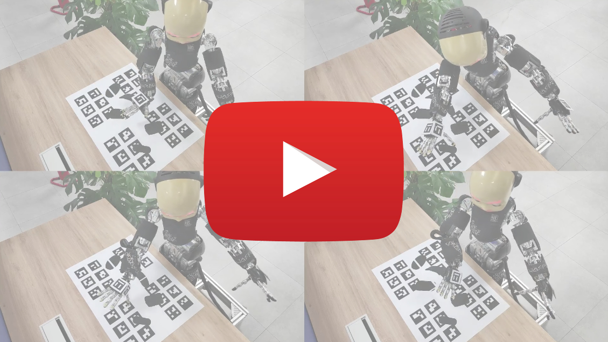

 <h1 align="center">Welcome to <b>GRASPA</b>!</h1>

<p align="center"> 

 
 
 
 
 
 
</p>
 
<p align="center">
 
  
</p>

**GRASPA (GRASPA is a Robot Arm graSping Performance benchmArk)** is
 a benchmarking protocol and a set of metrics to evaluate the performance of grasp planners. It aims to **fairly compare methodologies tested on different robots** by measuring and accounting for **platform limitations** that might affect the performance of the algorithm itself.

 ## Version 1.0
 Version 1.0 features:
 -  **3 printable layouts** of predefined grasping scenarios (composed of a subset of YCB objects and localization markers) to enhance test reproducibility.
 - A protocol to **assess** the **robot reachability** and the **calibration of the vision system** within the defined grasping setup area.
 - Usage of a popular **grasp quality metric** to evaluate user-provided grasping poses.
 - A score to assess the **grasp stability during the practical execution** on the robot.
 - The possibility to **benchmark** the algorithm **either in isolation or in the clutter**, with the definition of a further metric to  evaluate the obstacle avoidance in the clutter modality.
 - A **composite score** to quantify the **overall performance** of the algorithm **accounting for** reachability and calibration **limits of the test platform**.

 [](https://youtu.be/wUBHQQddJr0)

## Overview
- [How to install](https://github.com/hsp-iit/GRASPA-benchmark#how-to-install)
- [How to run](https://github.com/hsp-iit/GRASPA-benchmark#how-to-run)
- [Resources&Tools](https://github.com/hsp-iit/GRASPA-benchmark#resourcestools)
- [How to collect data](https://github.com/hsp-iit/GRASPA-benchmark#how-to-collect-the-data)
 ## How to install
  ### Using GitPod
  We have packaged a GitPod environment with every dependency compiled and already installed. Click on the button to open the cloud environment in your browser.

 [](https://gitpod.io/#https://github.com/hsp-iit/GRASPA-benchmark)

 ### Locally
 To ease the installation process, please use the Docker image we prepared.

 ```
 docker pull ghcr.io/hsp-iit/graspa-benchmark:latest
 ```

 ## How to run
 ### Using GitPod
 GitPod is a cloud-based development environment that allows users to test code from a GitHub repository without having to set up the environment and dependencies on their local machine. We have set up such an environment for this repo to allow users to test the code in the most hassle-free way.

 To further smoothen user experience, our GitPod instance comes with a Fluxbox desktop environment packed in. Once the environment is ready (it takes a while), GitPod will signal the user that a service is available on port 8080. By clicking on the `Open Browser` option, you will be automatically connected to the in-browser desktop. Otherwise, click `Remote Explore` tab in Gitpod, the Gitpod Workspace dropdown shows several ports. Select `Open Browser` for the 8080 port and click on `vnc_auto.html` to visualize the remote desktop.    

 To test the code on the data that we gathered for the paper and see the outcome, simply open a terminal in the remote desktop and type
 ```
     cd /path/to/GRASPA-benchmark
     $ ./src/script_launcher.sh
  ```

  and the bash script will perform every step required to compute the benchmark score of our platform.

 ### Locally
 You can use the Docker image you just pulled. Fire it up with
 ```
 docker run -it --rm -p 8080:8080 ghcr.io/hsp-iit/graspa-benchmark
 ```
 and then navigate from your favourite web browser to `http://localhost:8080`. At this point, open a terminal and proceed as outlined in the GitPod instructions section.

 Once the data required by the benchmark are available (see [here](https://github.com/hsp-iit/GRASPA-benchmark#how-to-collect-the-data) instructions on how to collect them), all the scores can be computed by:
 1. Properly pointing to the folders including the data in the [`src/script_launcher.sh`](https://github.com/hsp-iit/GRASPA-benchmark/blob/master/src/script_launcher.sh). More information on how to fill correctly the script is available [here](https://github.com/hsp-iit/GRASPA-benchmark/blob/master/src/README.md#graspa-score-computation).
 2. Launching the script:
     ```
     cd $GRASPA_DIR
     $ ./src/script_launcher.sh
     ```
    An example of the benchmark output is available [here](https://github.com/hsp-iit/GRASPA-benchmark/blob/master/src/README.md#output-example).

 ## Resources&Tools
**GRASPA 1.0** comes with several resources and tools:
-  [`data/`](https://github.com/hsp-iit/GRASPA-benchmark/tree/master/data) collects the:
   - [`YCB objects models`](https://github.com/hsp-iit/GRASPA-benchmark/tree/master/data/objects/YCB) used in the grasping layouts;
   - the [`3D renders of the grasping layouts`](https://github.com/hsp-iit/GRASPA-benchmark/tree/master/data/scenes/grasping/3D_scenes);
   - the [`printable versions`](https://github.com/hsp-iit/GRASPA-benchmark/tree/master/data/scenes/grasping/printable_layouts);
   - the poses to be reached for the [`reachability test`](https://github.com/hsp-iit/GRASPA-benchmark/tree/master/data/scenes/reachability) and the [`camera-calibration test`](https://github.com/hsp-iit/GRASPA-benchmark/tree/master/data/scenes/camera_calibration).
   - [`template files`](https://github.com/hsp-iit/GRASPA-benchmark/tree/master/data/template_files), the `xmls` to be filled with the data collected on your robot in order to compute the benchmark scores.
- [`src/`](https://github.com/hsp-iit/GRASPA-benchmark/tree/master/src) includes several scripts and executables:
   - a [`launcher script`](https://github.com/hsp-iit/GRASPA-benchmark/blob/master/src/script_launcher.sh) to automatically compute all the scores;
   - a [`C++ executable`](https://github.com/hsp-iit/GRASPA-benchmark/tree/master/src/compute-grasp-quality#grasp-quality-computation) to compute the **grasp quality** score using [Simox](https://gitlab.com/Simox/simox);
   - a [`python script`](https://github.com/hsp-iit/GRASPA-benchmark/blob/master/src/scores_evaluation.py) to combine all the information to get the **benchmark scores**;
   - a [`viewer`](https://github.com/hsp-iit/GRASPA-benchmark/tree/master/src/scene-viewer#scene-viewer) to **visualize the data** provided within GRASPA and those collected by the user;
   - a [`python script`](https://github.com/hsp-iit/GRASPA-benchmark/tree/master/src/layout-printer#layout-printer) to automatically **generate the printable layouts** of the grasping scenarios defined by **GRASPA 1.0**.

 ## [How to collect the data](/data_collection)
