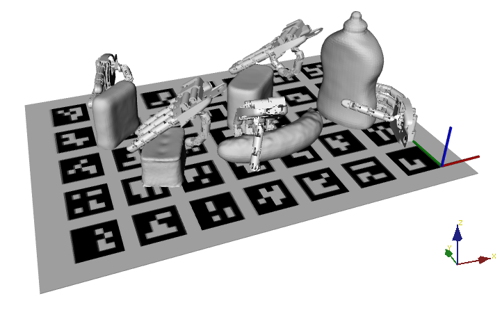

# GRASPA score computation
We provide a [bash script](https://github.com/robotology/GRASPA-benchmark/blob/master/src/script_launcher.sh) to automatically compute all the scores defined within **GRASPA 1.0**.

In order to properly run the script, the user is required to fill some information in:
- [`REACHED_POSES_FOLDER`](https://github.com/robotology/GRASPA-benchmark/blob/master/src/script_launcher.sh#L3), the folder including the data collected during the **reachability test**. An example of reachability folder is given in  [`GRASPA-test`](https://github.com/robotology-playground/GRASPA-test/tree/master/experiment_data/right_arm/reaching_test), that collects the data acquired on the iCub humanoid robot.

- [`FILE_CAMERA_CALIBRATION`](https://github.com/robotology/GRASPA-benchmark/blob/master/src/script_launcher.sh#L4), the file including the data collected during the **camera calibration test**. An example of camera calibration file is given in  [`GRASPA-test`](https://github.com/robotology-playground/GRASPA-test/tree/master/experiment_data/right_arm/camera_calibration), that collects the data acquired on the iCub humanoid robot.

- [`GRASPS_FOLDER`](https://github.com/robotology/GRASPA-benchmark/blob/master/src/script_launcher.sh#L5), the folder including the data collected during the **grasp execution on a specific layout**. An example of grasps folder is given in  [`GRASPA-test`](https://github.com/robotology-playground/GRASPA-test/tree/master/experiment_data/right_arm/grasps_data/layout_0), that collects the data acquired on the iCub humanoid robot.

- [`LAYOUT_NAME`](https://github.com/robotology/GRASPA-benchmark/blob/master/src/script_launcher.sh#L6), the **name of the layout** on which the grasping data have been collected. Accepted labels: `Benchmark_Layout_0`, `Benchmark_Layout_1`, `Benchmark_Layout_2`.


- [`MODALITY`](https://github.com/robotology/GRASPA-benchmark/blob/master/src/script_launcher.sh#L7) to specify **if the benchmarking is executed in isolation** (label: `isolation`) or **in the clutter** (label: `clutter`).

- [`THRES_POS_REACH`](https://github.com/robotology/GRASPA-benchmark/blob/master/src/script_launcher.sh#L8) to specify the threshold on the minimum acceptable **position error** for the **reachability test**.

- [`THRES_ORIE_REACH`](https://github.com/robotology/GRASPA-benchmark/blob/master/src/script_launcher.sh#L9) to specify the threshold on the minimum acceptable **orientation error** for the **reachability test**.

- [`THRES_REACH`](https://github.com/robotology/GRASPA-benchmark/blob/master/src/script_launcher.sh#L10) to specify the **percentage of poses to be reached** with the specified position and orientation thresholds to consider a **region reachable by the robot**.

- [`THRES_POS_CAM`](https://github.com/robotology/GRASPA-benchmark/blob/master/src/script_launcher.sh#L11) to specify the threshold on the minimum acceptable **position error** for the **camera calibration test**.

- [`THRES_ORIE_CAM`](https://github.com/robotology/GRASPA-benchmark/blob/master/src/script_launcher.sh#L12) to specify the threshold on the minimum acceptable **orientation error** for the **camera calibration test**.

- [`THRES_CAM`](https://github.com/robotology/GRASPA-benchmark/blob/master/src/script_launcher.sh#L13) to specify the **percentage of poses to be reached** with the specified position and orientation thresholds to consider a **region with a good camera calibration of the robot**.


First, the **grasp quality for each grasp** in the specific layout is evaluated using [`compute-grasp-quality`](https://github.com/robotology/GRASPA-benchmark/tree/master/src/compute-grasp-quality). The grasp qualities are **added in the grasps data** and, finally, **each score of the benchmark is computed** by [`scores_evaluation.py`](https://github.com/robotology/GRASPA-benchmark/blob/master/src/scores_evaluation.py).

## Output example

### Grasp quality evaluation
The program will load the scene, objects and the robot end effector. It will compute the grasp quality for every pose for every object in the layout according to the GWS metric. As output, it will show something like



If there are more grasps planned for the same object, more instances of the end effector will show up in the corresponding poses.

The script will write the computation results by adding a ``<ComputedQuality>`` field to the grasp XML files. In this example, planning 5 grasps for each object results as the following field being added:

```
<ComputedQuality>
    <Grasp name="Grasp 0" quality_collision_free="0.357533" quality_overall="0.250273"/>
    <Grasp name="Grasp 1" quality_collision_free="0.0883257" quality_overall="0.0529954"/>
    <Grasp name="Grasp 2" quality_collision_free="0.372534" quality_overall="0.149013"/>
    <Grasp name="Grasp 3" quality_collision_free="0.37403" quality_overall="0.299224"/>
    <Grasp name="Grasp 4" quality_collision_free="0.438608" quality_overall="0.219304"/>
</ComputedQuality>
```

To compute grasp quality, each grasp is perturbed in both position and orientation and the results are averaged.

- `quality_collision_free` refers to the quality of each grasp planned for the object (averaged over the set of perturbations) only in case the grasps are not in a collision state with the object
- `quality_overall` refers to the average quality of all perturbed grasps, regardless of whether they are initially in collision or not.


### Benchmark scores computation
- The benchmark scores are computed for **one layout per time**:

 <p align="center">

</p>

- The **reachability and camera calibration scores** are computed by comparing the
poses defined within the benchmark with those acquired by the user:

 <p align="center">
 
</p>

- The **graspability, binary success and grasp stability** are just read from the files provided by the user:

 <p align="center">
  
</p>


- The **grasp quality** are read from the files properly filled by `compute-grasp-quality`:

<p align="center">

</p>

- In the clutter modality, also the **obstacle avoidance scores** are read from the files provided by the user:

<p align="center">

</p>

- Then, the **final score for the layout under test** is provided:

<p align="center">

</p>
