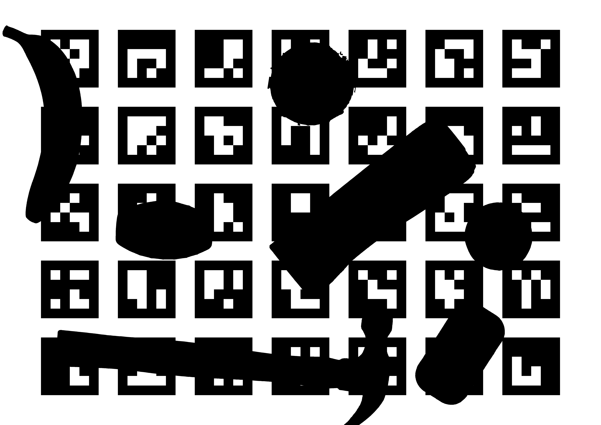
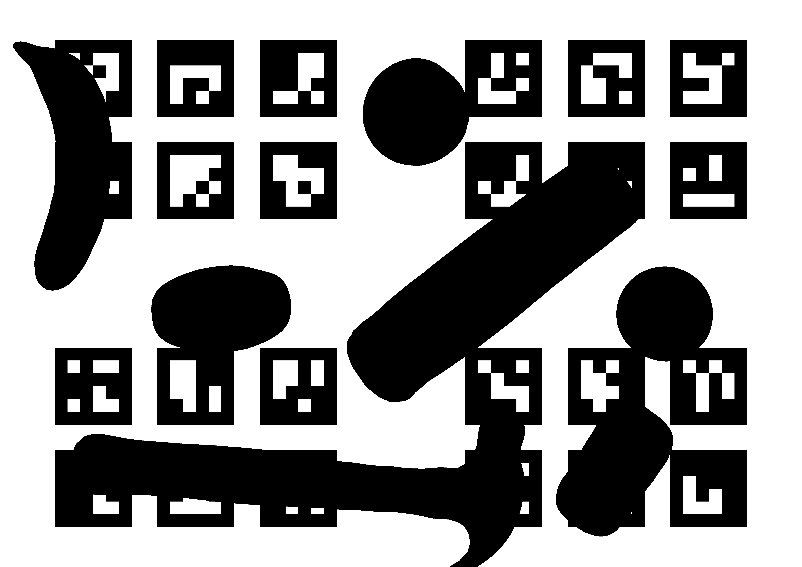

# Layout printer

This simple Python 3 script allows users to **produce printout files** from custom GRASPA scenarios.

## How to build a layout

The script parses layout XML files as produced by the Simox suite. For examples, please refer to the [layouts](https://github.com/robotology/GRASPA-benchmark/tree/master/data/scenes/grasping/3D_scenes) already provided by the benchmark. These files contain fields corresponding to

- the layout name (field `<Scene>`)
- each object in the layout (field `<ManipulationObject>`)
    - object name, as appearing in the [data directory](https://github.com/robotology/GRASPA-benchmark/tree/master/data/objects/YCB)
    - object XML file, containing the mesh and collision model (field `<File>`)
    - object pose with respect to the layout reference frame, i.e. bottom-right marker, defined with a 4x4 matrix (field `<Transform>`)
- the Table object, representing the layout surface
- the layout reference frame.

New layouts can be built by replicating existing layouts and simply changing the number, type and pose of the objects. GRASPA 1.0 comes with 16 YCB objects, but any other object can be added if a mesh and collision model are provided.

## How to produce printouts

The script essentially loads the object meshes and projects them on the table surface, adding markers to produce a benchmark layout board. The parser help can be brought up by launching

```
python layout_printer.py --help
usage: layout_printer.py [-h] [-c] layout datadir

Render a 2D projection of the layout on top of the custom aruco board

positional arguments:
  layout       Path to the layout file
  datadir      Path to the repo root directory

optional arguments:
  -h, --help   show this help message and exit
  -c, --cross  Exclude the central marker row and column in the board
```

The parser refers to the _repo root directory_ as the one [containing the data directory](https://github.com/robotology/GRASPA-benchmark). Layouts provided with the benchmark are in [this directory](https://github.com/robotology/GRASPA-benchmark/tree/master/data/scenes/grasping/3D_scenes). The script outputs a set of printouts in the same directory as the `layout` file.

Layouts are assumed to be printed in a A2 paper format (594x420 mm). Since not everyone has access to a A2 printer, though, the script also splits the resulting image in 4 A4 pages, which is the standard for most printers.

## Example


3D view of layout 1 (provided by the scene viewer):


```
python layout_printer.py ../../data/scenes/grasping/3D_scenes/layout_1.xml ../../
```




```
python layout_printer.py --cross ../../data/scenes/grasping/3D_scenes/layout_1.xml ../../
```


